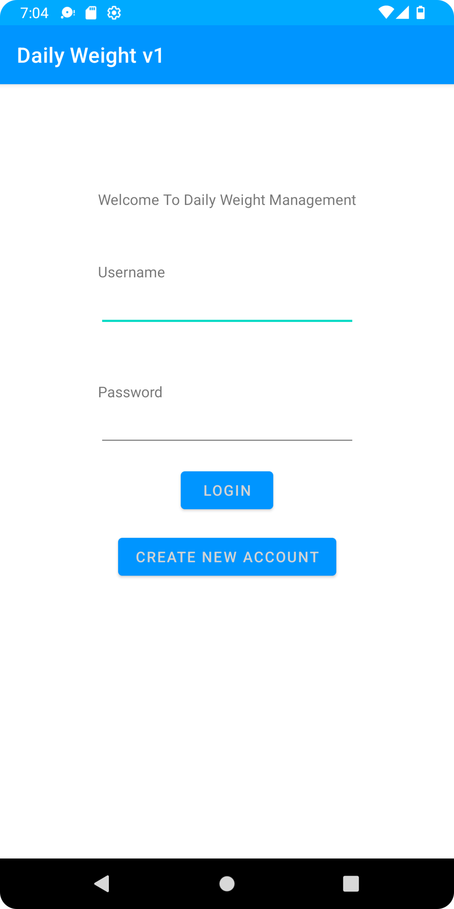
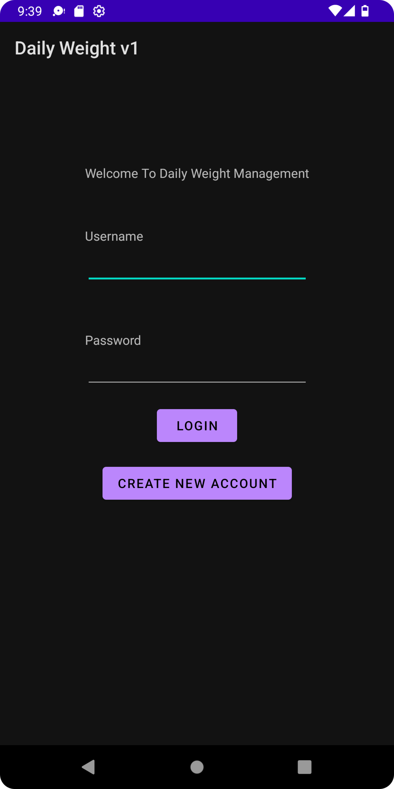

# **Samuel Hemond ePortfolio**

[comment]: <> (Adds table of contents to the Github pages page for https://igthife.github.io/)
* TOC
{:toc}

## Professional Self Review


[Professional Self Review PDF](CS-499_Professional_Self_Assessment.pdf)

## Code Review
This is a short summary of my code review video of this
[Original Code Artifact](https://github.com/Igthife/Igthife.github.io/tree/main/CS360ArtifactSamuelHemond)
.

This artifact was created for CS-360 and SNHU and is an Android app designed to help track daily weight measurements of a user and then text
 the user when their desired weight is hit. The starting state of the app had 4 pages. One for logging in, one for displaying weights and goal
 weight, one for entering a phone number, and finally one for entering goal or daily weights. All three of my enhancements were 
 completed on this artifact.

[Video of my full code review from my CS-360 Artifact used for all enhancements](https://youtu.be/2A69vkAXrOA "code review used for all enhancements")<br/>

## Enhancement I Software Design and Engineering

### Summary
This enhancement was focused on the design of the structure of the application. Most of the changes visible to users were in the design of
the XML files and the integration of themes throughout the application as can be seen in the following section. The colors of the theme were
also integrated into an icon for the application to make it appear more professional. I also added a drawer in the main page or the page that 
displays the users weights. This drawer was added to hold various settings that would be accessed less often than other parts of the application
 and a screenshot of this function is located in the section below.
 
Beyond this, the remainder of this Enhancement focused on better and more comments as well as formatting of the code itself. Breaking some
 functionality into new classes to handle new activities and to produce better readable code.
 
Supporting Imagery and Links to the enhancement repository and full Enhancement Narrative are below.
 

### Supporting Imagery 

Light theme before enhancement.<br/>


Dark theme before enhancement.<br/>


Light theme after enhancement.<br/>


Dark theme after enhancement.<br/>


Drawer in dark theme after enhancement.<br/>


### Enhancement I Links

[Artifact after Enhancement I](https://github.com/Igthife/Igthife.github.io/tree/Enhancment-1-Software-Design/CS360ArtifactSamuelHemond "Artifact after Enhancement I")<br/><br/>
[Full Enhancement I Narrative](CS-499_Milestone_Two_Narrative.pdf)

## Enhancement II Algorithms and Data Structure

### Summary
For this enhancement, I completed most of my algorithm focused courses at UNH before transferring to SNHU and did not have access to my code from
those courses. This was also a good time to implement some better security on my Android application that I worked on in the previous 
enhancement. To this end, I wrote a SHA-256 algorithm in Java and implemented it within my application. Along with this, I added checks for
 formatting of user's usernames and passwords. While I realize usings an implementation  using standard libraries this enhancement was designed to
 show knowledge with algorithms. To this end in a production application, I would not only utilize standard cryptographically secure libraries 
 as well as proper hashing implementation.

### SHA-256 Pseudocode

The following is a section of pseudocode taken from Wikipedia on which my code was based (SHA-2 2024).
<br/>
To check for the correct process during implementation  I checked my algorithm against [this implementation](https://sha256algorithm.com "SHA-256 algorithm") (Martin , 2022).
I also included a standard implementation of SHA-256 using appropriate libraries for comparison.
```
Note 1: All variables are 32 bit unsigned integers and addition is calculated modulo 232
Note 2: For each round, there is one round constant k[i] and one entry in the message schedule array w[i], 0 ≤ i ≤ 63
Note 3: The compression function uses 8 working variables, a through h
Note 4: Big-endian convention is used when expressing the constants in this pseudocode,
    and when parsing message block data from bytes to words, for example,
    the first word of the input message "abc" after padding is 0x61626380

Initialize hash values:
(first 32 bits of the fractional parts of the square roots of the first 8 primes 2..19):
h0 := 0x6a09e667
h1 := 0xbb67ae85
h2 := 0x3c6ef372
h3 := 0xa54ff53a
h4 := 0x510e527f
h5 := 0x9b05688c
h6 := 0x1f83d9ab
h7 := 0x5be0cd19

Initialize array of round constants:
(first 32 bits of the fractional parts of the cube roots of the first 64 primes 2..311):
k[0..63] :=
   0x428a2f98, 0x71374491, 0xb5c0fbcf, 0xe9b5dba5, 0x3956c25b, 0x59f111f1, 0x923f82a4, 0xab1c5ed5,
   0xd807aa98, 0x12835b01, 0x243185be, 0x550c7dc3, 0x72be5d74, 0x80deb1fe, 0x9bdc06a7, 0xc19bf174,
   0xe49b69c1, 0xefbe4786, 0x0fc19dc6, 0x240ca1cc, 0x2de92c6f, 0x4a7484aa, 0x5cb0a9dc, 0x76f988da,
   0x983e5152, 0xa831c66d, 0xb00327c8, 0xbf597fc7, 0xc6e00bf3, 0xd5a79147, 0x06ca6351, 0x14292967,
   0x27b70a85, 0x2e1b2138, 0x4d2c6dfc, 0x53380d13, 0x650a7354, 0x766a0abb, 0x81c2c92e, 0x92722c85,
   0xa2bfe8a1, 0xa81a664b, 0xc24b8b70, 0xc76c51a3, 0xd192e819, 0xd6990624, 0xf40e3585, 0x106aa070,
   0x19a4c116, 0x1e376c08, 0x2748774c, 0x34b0bcb5, 0x391c0cb3, 0x4ed8aa4a, 0x5b9cca4f, 0x682e6ff3,
   0x748f82ee, 0x78a5636f, 0x84c87814, 0x8cc70208, 0x90befffa, 0xa4506ceb, 0xbef9a3f7, 0xc67178f2

Pre-processing (Padding):
begin with the original message of length L bits
append a single '1' bit
append K '0' bits, where K is the minimum number >= 0 such that (L + 1 + K + 64) is a multiple of 512
append L as a 64-bit big-endian integer, making the total post-processed length a multiple of 512 bits
such that the bits in the message are: <original message of length L> 1 <K zeros> <L as 64 bit integer> 
, (the number of bits will be a multiple of 512)

Process the message in successive 512-bit chunks:
break message into 512-bit chunks
for each chunk
    create a 64-entry message schedule array w[0..63] of 32-bit words
    (The initial values in w[0..63] don't matter, so many implementations zero them here)
    copy chunk into first 16 words w[0..15] of the message schedule array

    Extend the first 16 words into the remaining 48 words w[16..63] of the message schedule array:
    for i from 16 to 63
        s0 := (w[i-15] rightrotate  7) xor (w[i-15] rightrotate 18) xor (w[i-15] rightshift  3)
        s1 := (w[i-2] rightrotate 17) xor (w[i-2] rightrotate 19) xor (w[i-2] rightshift 10)
        w[i] := w[i-16] + s0 + w[i-7] + s1

    Initialize working variables to current hash value:
    a := h0
    b := h1
    c := h2
    d := h3
    e := h4
    f := h5
    g := h6
    h := h7

    Compression function main loop:
    for i from 0 to 63
        S1 := (e rightrotate 6) xor (e rightrotate 11) xor (e rightrotate 25)
        ch := (e and f) xor ((not e) and g)
        temp1 := h + S1 + ch + k[i] + w[i]
        S0 := (a rightrotate 2) xor (a rightrotate 13) xor (a rightrotate 22)
        maj := (a and b) xor (a and c) xor (b and c)
        temp2 := S0 + maj
 
        h := g
        g := f
        f := e
        e := d + temp1
        d := c
        c := b
        b := a
        a := temp1 + temp2

    Add the compressed chunk to the current hash value:
    h0 := h0 + a
    h1 := h1 + b
    h2 := h2 + c
    h3 := h3 + d
    h4 := h4 + e
    h5 := h5 + f
    h6 := h6 + g
    h7 := h7 + h

Produce the final hash value (big-endian):
digest := hash := h0 append h1 append h2 append h3 append h4 append h5 append h6 append h7
```

### Enhancement II Links

[Class containing SHA-256 hashing function](https://github.com/Igthife/Igthife.github.io/blob/Enhancment-2-Algorithm/CS360ArtifactSamuelHemond/app/src/main/java/com/example/cs360project3samuelhemond/EncryptionAlgorithm.java "Artifact after Enhancement I")<br/><br/>
[Artifact after Enhancement II](https://github.com/Igthife/Igthife.github.io/tree/Enhancment-2-Algorithm/CS360ArtifactSamuelHemond "Artifact after Enhancement II")<br/><br/>
[Full Enhancement II Narrative](CS-499_Milestone_Three_Narrative.pdf)

## Enhancement III Databases

### Summary


## Citations
>Martin , D. (2022, March 24). SHA256 algorithm explained. Sha256 Algorithm Explained. https://sha256algorithm.com/
<br/><br/>
>Wikimedia Foundation. (2024, June 13). SHA-2. Wikipedia. https://en.wikipedia.org/wiki/SHA-2 

