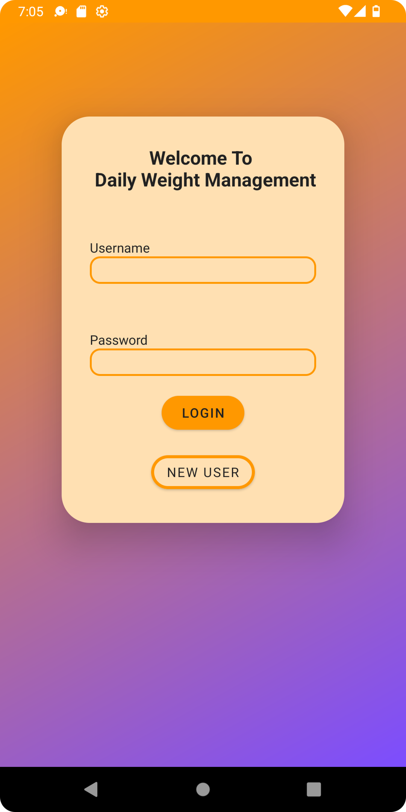
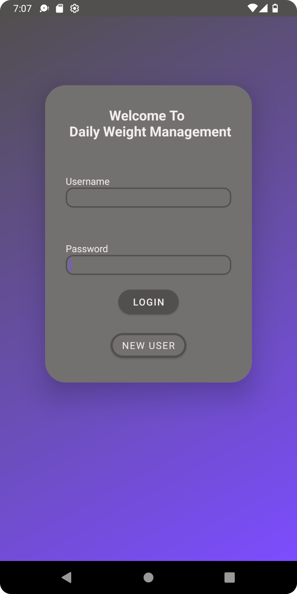

# **Samuel Hemond ePortfolio**

## CS-499 Capstone Project

## Code Review
For SNHU's CS-499 Capstone project:
[Original Artifact](https://github.com/Igthife/Igthife.github.io/tree/main/CS360ArtifactSamuelHemond)
.

This artifact was created for CS-360 and SNHU and is an Android app
 designed to help track daily weight measurements of a user and then text
 the user when their desired weight is hit.

[CS-360 Artifact code review used for all enhancements](https://youtu.be/2A69vkAXrOA "code review used for all enhancments") 

## Enhancement I Software Design and Engineering

### Summary
This enhancement was focused on the design of the structure of the application. Most of the changes visible to users were in the design of
the XML files and the integration of themes throughout the application as can be seen in the following section. The colors of the theme were
also integrated into a icon for the application to make it appear more professional.

### Supporting Imagery 

Light theme before enhancement. 

Dark theme before enhancement. 

Light theme after enhancement. 

Dark theme after enhancement. 

Drawer in dark theme. 

### Enhancement I Links

[Artifact after Enhacment I](https://github.com/Igthife/Igthife.github.io/tree/Enhancment-1-Software-Design "Artifact after Enhancement I") 
[Full Enhancement  I Narritive](CS-499_Milestone_Two_Narrative.docx)

## Enhancement II Algorithms and Data Structure

## Enhancement III Databases
